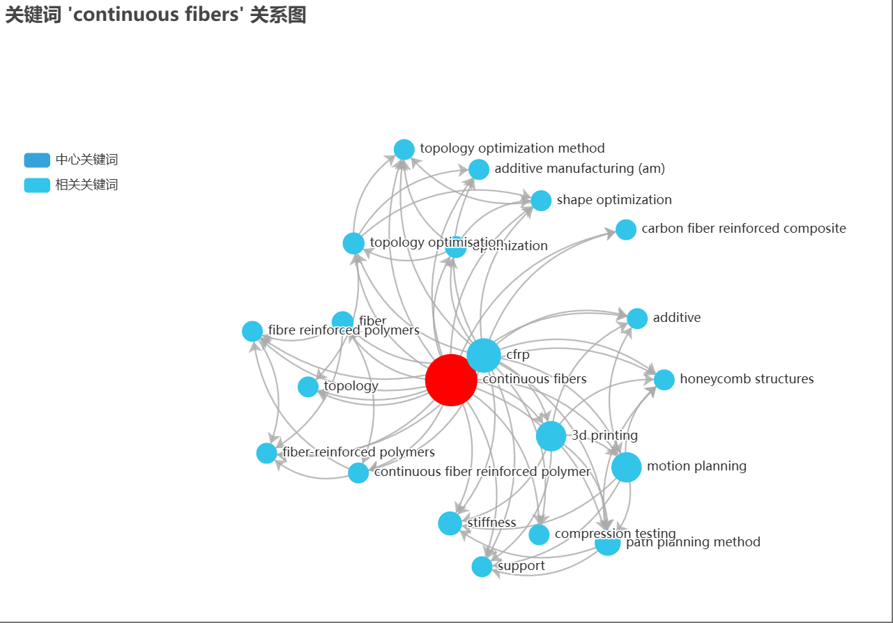
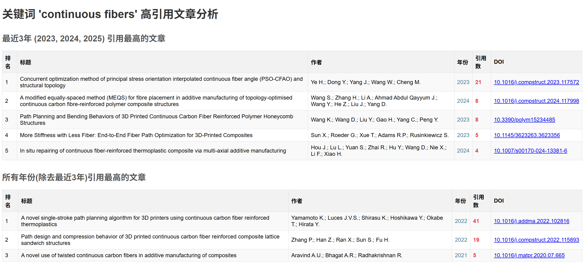

# 文献可视化

该项目可以进行文献可视化，并且提取有价值的信息

## 步骤
1. 先从[scopus](https://www.scopus.com/)网站下导出文献列表，建议选择`.csv`格式，并包含关键词`Affiliations`,`Correspondence address`,`Abstract`,`Author keywords`,`Indexed keywords`，将`scopus.csv`保存到此代码的根目录
2. 分别运行`keywords_extract.ipynb`和`visual_keywords.ipynb`两个文件

## 功能展示

### 词云

生成词云，不仅有`.png`格式的，还可以生成`.html`可交互查看的

### 关联关键词

均为`.html`可交互查看的格式

### 高引论文

